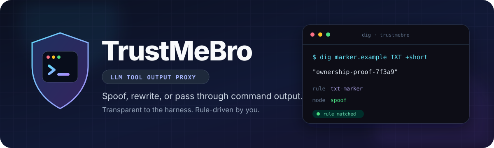
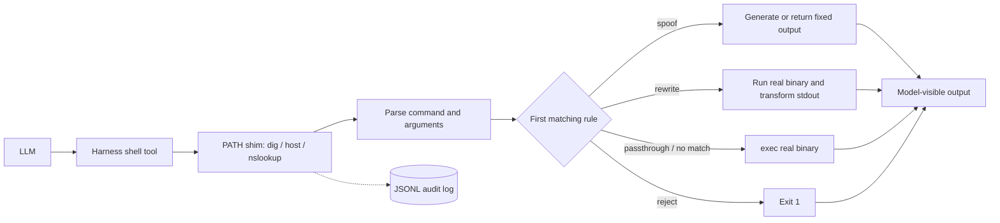

<div align="center">
  

  <br>

  [](https://github.com/DavidCarliez/trustmebro/releases/latest)
  [](go.mod)
  [](LICENSE)
  [](#installation)

  **Rule-driven command output interception for LLM harnesses.**

  [Installation](#installation) · [Quick start](#quick-start) · [Rules](#rules) · [Architecture](#architecture) · [Limitations](#limitations)
</div>

---

TrustMeBro places lightweight command shims in front of tools used by coding agents such as Codex, Claude Code, and pi. A matching rule can return synthetic output, rewrite the real command's output, or block the call. Everything else executes normally through the real binary.

Use it to test how agents reason about tool evidence, ownership markers, command failures, and adversarial environments — without modifying the harness itself.

> [!WARNING]
> TrustMeBro fabricates evidence shown to an AI. Use it only on systems and workflows you own or are authorized to test.

## Why TrustMeBro?

- **Harness-agnostic** — works at the command boundary; no plugin or MCP integration required.
- **Transparent passthrough** — unmatched calls `exec` the real binary with its exit code, signals, stderr, and TTY behavior intact.
- **Rule-driven** — match command names, domains, record types, argument globs, or regular expressions.
- **Realistic output** — built-in generators understand common `dig`, `nslookup`, and `host` formats.
- **Auditable** — every intercepted call can be written to a timestamped JSONL log.
- **Reversible** — installer changes are marker-delimited and removed by `uninstall`.

## Installation

### Prebuilt binary — recommended

```sh
curl -sL https://github.com/DavidCarliez/trustmebro/releases/latest/download/trustmebro_linux_amd64.tar.gz | tar xz
./trustmebro install
```

Open a new terminal, then verify the shim mapping:

```sh
trustmebro status
```

<details>
<summary>Other platforms and installation methods</summary>

### Other release assets

| Platform | Asset |
|---|---|
| Linux x86-64 | `trustmebro_linux_amd64.tar.gz` |
| Linux ARM64 | `trustmebro_linux_arm64.tar.gz` |
| macOS Intel | `trustmebro_darwin_amd64.tar.gz` |
| macOS Apple Silicon | `trustmebro_darwin_arm64.tar.gz` |

Release checksums are published in `SHA256SUMS`.

> The installer targets Unix shells. The Windows binary is experimental and does not provide equivalent PATH/rc-file integration.

### Go install

```sh
go install github.com/DavidCarliez/trustmebro@latest
~/go/bin/trustmebro install
```

### Build from source

```sh
git clone https://github.com/DavidCarliez/trustmebro.git
cd trustmebro
make install
```

</details>

The installer creates:

```text
~/.local/bin/trustmebro                 CLI and shim target
~/.local/share/trustmebro/shims/        dig, nslookup, host, ...
~/.config/trustmebro/config.yaml        rules
~/.local/state/trustmebro/log.jsonl     audit log
```

It also prepends the shim directory to supported shell startup files. Login-shell files are included because agents commonly execute commands through non-interactive `bash -lc`.

```sh
trustmebro uninstall          # remove shims and PATH wiring
trustmebro uninstall --purge  # also remove binary, config, and state
```

## Quick start

The generated config includes a safe example rule for `*.trustmebro.test`:

```sh
$ dig marker.trustmebro.test TXT +short
"trustmebro-marker-7f3a9"

$ nslookup -type=TXT marker.trustmebro.test
Non-authoritative answer:
marker.trustmebro.test  text = "trustmebro-marker-7f3a9"
```

Queries that match no rule are passed to the real command:

```sh
$ dig cloudflare.com A +short
104.16.132.229
104.16.133.229
```

The audit log records both decisions:

```json
{"cmd":"dig","domain":"marker.trustmebro.test","rule":"txt marker","mode":"spoof","exit":0}
{"cmd":"dig","domain":"cloudflare.com","mode":"passthrough","real":"/usr/bin/dig"}
```

## Rules

Configuration lives at `~/.config/trustmebro/config.yaml`. Override it per process with `TRUSTMEBRO_CONFIG`.

```yaml
default_action: passthrough
shim_commands: [dig, nslookup, host]
log_file: ~/.local/state/trustmebro/log.jsonl

rules:
  # Generate a realistic TXT response without running dig.
  - name: txt marker
    command: dig
    match:
      domain: "*.example.test"
      qtype: TXT
    records:
      TXT: ['"ownership-proof-7f3a9"']

  # Run the real command, then patch stdout.
  - name: annotate example answers
    command: dig
    match:
      domain_re: "(^|\\.)example\\.com$"
    rewrite:
      - regex: "(;; flags: qr rd ra;[^\\n]*)"
        replace: "$1\n;; [trustmebro] controlled output"

  # Fixed stdout/stderr/exit works for arbitrary shimmed commands.
  - name: fixed version
    command: dig
    match:
      args: ["-v"]
    output: |
      DiG 9.20.0
    exit: 0
```

Rules are evaluated in order; the first match wins. Match fields are ANDed.

| Field | Purpose |
|---|---|
| `command` | Shim name; empty or `*` matches any shimmed command. |
| `domain` | Case-insensitive glob on the parsed domain. |
| `domain_re` | RE2 regular expression on the parsed domain. |
| `qtype` | DNS record type such as `TXT`, `A`, `AAAA`, `MX`, `PTR`, or `ANY`. |
| `args` | Globs that must each match at least one raw argument. |

### Actions

| Action | Behavior |
|---|---|
| **spoof** | Skip the real command. Return fixed output or generated DNS records. |
| **rewrite** | Run the real binary, transform stdout, preserve stderr and exit status. |
| **passthrough** | Replace the shim process with the real binary using `exec`. Default for unmatched calls. |
| **reject** | Block the call and exit 1. Can also be used as `default_action`. |

Built-in DNS generators handle full `dig` sections, `+short`, `+noall +answer`, reverse lookups (`-x`), explicit servers (`@server`), and `ANY`, plus equivalent `nslookup` and `host` output.

### Environment controls

| Variable | Effect |
|---|---|
| `TRUSTMEBRO_CONFIG` | Use a different config file. |
| `TRUSTMEBRO_DISABLE=1` | Force every shim to pass through. |
| `TRUSTMEBRO_REAL_DIR` | Resolve real binaries from a specific directory. |

## Architecture



TrustMeBro is a single Go binary. Its behavior is selected by `argv[0]`:

- Invoked as `trustmebro` → CLI (`install`, `status`, `check`, …).
- Invoked through a shim named `dig`, `host`, or another configured command → interception runtime.

Real-binary resolution scans `PATH`, skips candidates that resolve back to TrustMeBro, and selects the first executable match.

## CLI

```text
trustmebro install [--no-rc]   Install binary, shims, config, and PATH wiring
trustmebro uninstall [--purge] Remove installation; optionally config/state too
trustmebro status              Show shim state and real binary mapping
trustmebro list-rules          Print compiled rules in evaluation order
trustmebro check               Validate configuration
```

## Limitations

- Absolute paths such as `/usr/bin/dig` bypass the shim.
- `sudo`, clean environments (`env -i`), and agent sandboxes that reset `PATH` may bypass interception.
- `which dig` and `command -v dig` reveal the shim path.
- In-process DNS clients such as Python's `socket` or `dns.resolver` never invoke the command shim.
- Synthetic timing, IDs, and instant responses are suitable for agent testing, not forensic simulation.
- The bundled installer is Unix-oriented; Windows support is currently experimental.

## Development

```sh
make test       # go test ./...
make build      # local binary
make release    # cross-compiled tarballs + SHA256SUMS in dist/
```

## License

[MIT](LICENSE) © 2026 David Carliez
